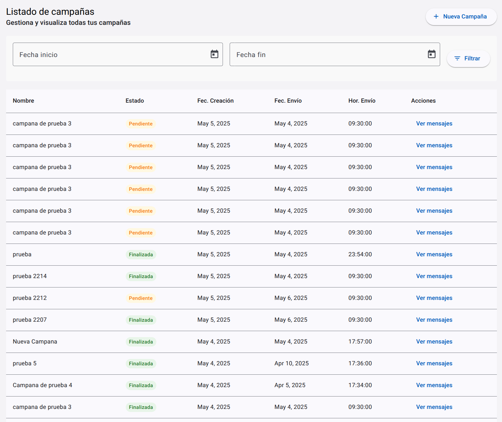
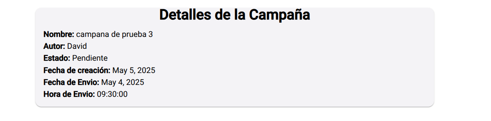

# Reto Técnico Sinapsis - Frontend

Este proyecto es el frontend del reto técnico para Sinapsis, desarrollado en Angular.

## 🚀 Cómo iniciar el servidor de desarrollo

Para iniciar el frontend en modo desarrollo, ejecuta:

```bash
ng serve
```

## 🌐 Configuración de la API
La aplicación se conecta a una API REST mediante una URL base que está definida en los archivos de environment de Angular.

Por defecto, la URL de la API en el entorno de desarrollo se encuentra configurada en el archivo:
```bash
src/environments/env.ts
```

con el siguiente valor:

```bash
export const env = {
  apiUrl: 'http://localhost:3000/dev'
};
```
✅ Si necesitas conectar a una API diferente (otro puerto, entorno o backend), modifica la propiedad apiUrl en este archivo.

## Evidencias


